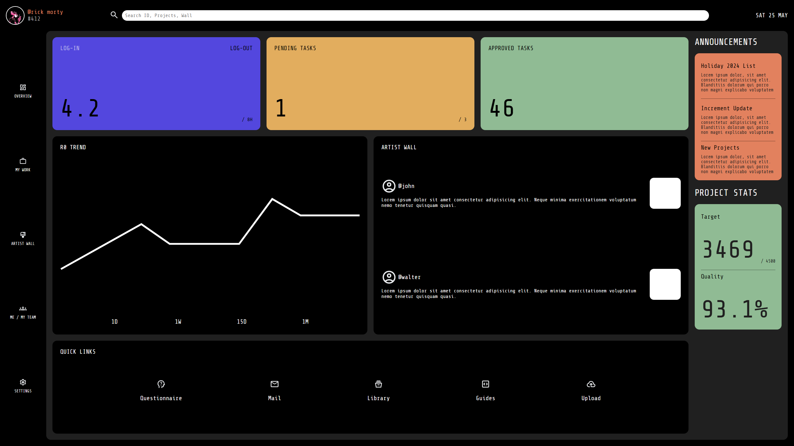

<h3 align="center">Dashboard</h3>

  

    Simple Dashboard for tracking work. 
     
    <a href="https://notsanta20.github.io/dashboard/" target="_blank">Live Demo</a>
  

 

<!-- ABOUT THE PROJECT -->
### Preview

 

### Built With

<!-- ACKNOWLEDGMENTS -->
## Acknowledgments

* Inspiration by <a href="https://www.theodinproject.com/lessons/node-path-intermediate-html-and-css-admin-dashboard#project-solution" target="_blank">The Odin Project</a>
